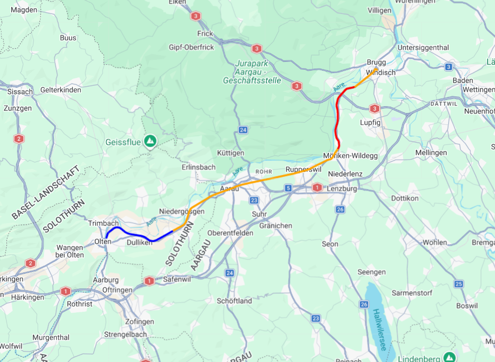

# Python Tutorial: GPS-Routen visualisieren mit KML

Im Rahmen von unserem Challenge-Modul CDE1 im Bachelor-Studiengang Data-Science & AI haben wir ein Container-Tracking-System gebaut. Wir haben GPS-Daten als CSV-Datei bekommen, diese ausgelesen, die Temperatur und Feuchtigkeit bewertet und die Route farbig auf einer Karte gezeichnet.

> 

Für dieses Tutorial wurde folgender Lerninhalt definiert:

**Lerninhalt:** Wie liest man strukturierte Sensordaten aus einer CSV-Datei aus, bewertet sie nach Kriterien (Temperatur, Luftfeuchtigkeit) und zeichnet die Route farbig auf einer Karte?

---

## Voraussetzungen

Bevor du beginnst, solltest du folgende Grundkenntnisse in Python mitbringen:

- **Datentypen:** Du weisst was Strings, Floats, Listen und Booleans sind
- **Bedingungen:** Du kennst `if`, `elif`, `else`
- **Schleifen:** Du kannst mit `for` über eine Liste iterieren
- **Funktionen:** Du weisst wie man eine Funktion mit `def` definiert und mit `return` einen Wert zurückgibt
- **Ordnerstruktur:** Du weisst was ein Projektordner ist und wie Dateipfade funktionieren

---

## Konzepte

### Virtuelle Umgebung mit venv

Bevor wir mit dem eigentlichen Code beginnen, richten wir die Arbeitsumgebung ein.

Wenn du einfach `pip install simplekml` ausführst, wird das Paket **global** installiert für den ganzen Computer. Das klingt praktisch, führt aber zu Problemen sobald du mehrere Projekte hast, die verschiedene Versionen desselben Pakets brauchen. Python kann nicht zwei Versionen gleichzeitig global installiert haben.

Die Lösung ist eine **virtuelle Umgebung**. Das ist ein isolierter Python-Bereich nur für dein Projekt. Jedes Projekt hat seine eigenen Pakete in eigenen Versionenm; kein Konflikt, kein Chaos.

```bash
# Im Projektordner: virtuelle Umgebung erstellen
python -m venv .venv

# Aktivieren auf Windows (PowerShell)
.\.venv\Scripts\Activate

# Aktivieren auf Mac / Linux
source .venv/bin/activate
```

Du merkst dass die venv aktiv ist wenn `(.venv)` vor deiner Eingabe erscheint:

```
(.venv) PS C:\mein-projekt>
```

Pakete installieren und festhalten:

```bash
pip install simplekml
pip freeze > requirements.txt
```

Die `requirements.txt` sieht dann zum Beispiel so aus:

```
simplekml==1.3.6
```

Wer das Tutorial bekommt, kann mit einem einzigen Befehl exakt dieselbe Umgebung wiederherstellen:

```bash
pip install -r requirements.txt
```

Den Ordner `.venv` teilst du nicht. Er kann aus `requirements.txt` jederzeit neu erstellt werden. Füge `.venv` in deine `.gitignore` ein wenn du Git verwendest.

---

### Packages

Ein **Package** ist fertiger Code den andere geschrieben haben und den du in deinem Projekt verwenden kannst. Statt alles selbst zu programmieren, nutzt du was bereits existiert.

Oben in jeder Python-Datei stehen die `import`-Zeilen. Sie laden den Code des Packages in dein Script:

```python
from pathlib import Path  # eingebaut in Python, kein pip nötig
import csv                # eingebaut in Python
import simplekml          # muss installiert werden: pip install simplekml
import webbrowser         # eingebaut in Python
```

Der Unterschied zwischen `import paket` und `from paket import teil`:

```python
import simplekml
# Zugriff immer mit Paketname: simplekml.Kml(), simplekml.Color.red

from pathlib import Path
# Direkter Zugriff: Path(...), kürzer weil wir nur Path brauchen
```

**Welche Packages wir verwenden und warum:**

**`csv`** ist bereits in Python eingebaut. Wir hätten auch `pandas` verwenden können, aber `pandas` ist ein grosses, komplexes Paket das für unseren Fall überdimensioniert wäre. Wir lesen eine Datei linear durch. Dafür reicht `csv` vollständig.

**`pathlib`** löst ein klassisches Problem mit Dateipfaden. Früher schrieb man Pfade als einfache Strings:

```python
# Alt, funktioniert nur auf diesem einen Computer
pfad = "C:\\Users\\User\\projekt\\daten.csv"
```

Mit `pathlib` geht das so:

```python
# Modern, funktioniert überall egal von wo man das Script startet
script_dir = Path(__file__).parent
pfad = script_dir / "daten.csv"
```

`__file__` ist eine eingebaute Variable die den absoluten Pfad der aktuellen Python-Datei enthält. `.parent` gibt den Ordner zurück in dem sie liegt. Der `/`-Operator bei `Path`-Objekten baut Pfade plattformunabhängig zusammen — kein Unterschied mehr zwischen Windows und Mac/Linux.

**`simplekml`** erzeugt KML-Dateien. **KML** (Keyhole Markup Language) ist ein XML-Format das Google Maps und viele andere Viewer verstehen, um geografische Daten wie Routen, Punkte und Flächen darzustellen. Wir hätten die KML-Datei von Hand als Text schreiben können, aber das wäre fehleranfällig und aufwändig. `simplekml` abstrahiert das weg.

**`webbrowser`** ist in Python eingebaut und öffnet eine URL im Standardbrowser des Computers. 

---

### Eigener Code in utils.py

Die Funktion `build_segments` liegt in einer gemeinsamen Datei `utils.py` im übergeordneten Ordner. Der Grund: dieselbe Logik wird in mehreren Projekten gebraucht. Damit Python sie findet, muss der übergeordnete Ordner zum Suchpfad hinzugefügt werden:

```python
import sys
sys.path.append(str(Path(__file__).parent.parent))
from utils import build_segments
```

`sys.path` ist die Liste der Ordner, in denen Python nach Modulen sucht. Mit `append` fügen wir den übergeordneten Ordner hinzu, bevor wir importieren.

---

## Schritt 1: CSV-Datei verstehen

Bevor wir Code schreiben, müssen wir wissen wie unsere Daten aussehen. Unsere CSV hat keine Header-Zeile, die Daten beginnen direkt in Zeile 1:

```
2024-03-15 08:00:00,47.3523,7.9072,22.1,65.3
2024-03-15 08:00:10,47.3541,7.9089,24.8,72.1
2024-03-15 08:00:20,47.3558,7.9103,26.3,81.5
```

Das ergibt folgende Spalten-Indizes:

```python
row[0]  # Zeitstempel  -> "2024-03-15 08:00:00"
row[1]  # Latitude     -> "47.3523"
row[2]  # Longitude    -> "7.9072"
row[3]  # Temperatur   -> "22.1"
row[4]  # Feuchtigkeit -> "65.3"
```

`csv.reader` liest alles als **String**, auch Zahlen. `"22.1"` ist kein Zahlenwert, man kann damit nicht rechnen oder vergleichen. Deshalb müssen wir `float(row[3])` schreiben um den String in eine Dezimalzahl umzuwandeln.

---

## Schritt 2: Packages und Pfade einrichten

```python
from pathlib import Path
import sys
sys.path.append(str(Path(__file__).parent.parent))
from utils import build_segments
import csv
import simplekml
import webbrowser

SCRIPT_DIR = Path(__file__).parent
CSV_PATH = SCRIPT_DIR / "olten-brugg (2).csv"
KML_PATH = SCRIPT_DIR / "olten-brugg.kml"
```

Die Pfade stehen als globale Variablen ganz oben, weil sie sich nicht ändern und von mehreren Funktionen gebraucht werden.

---

## Schritt 3: CSV einlesen

```python
def read_csv(csv_path):
    with open(csv_path, "r", newline="") as f:
        inputfile = csv.reader(f)
        rows = list(inputfile)
        return rows
```

Das `with`-Statement stellt sicher dass die Datei automatisch geschlossen wird, auch wenn ein Fehler passiert. Das ist sicherer als manuell `f.close()` aufzurufen.

`newline=""` verhindert dass Python Zeilenumbrüche doppelt interpretiert. Das ist eine Empfehlung der offiziellen Python-Dokumentation für `csv.reader`.

`list(inputfile)` wandelt den CSV-Reader in eine Liste um. Jede Zeile der CSV-Datei wird dabei selbst zu einer Liste von Strings — `rows` ist also eine **Liste von Listen**:

```python
[
  ['2024-03-15 08:00:00', '47.3523', '7.9072', '22.1', '65.3'],
  ['2024-03-15 08:00:10', '47.3541', '7.9089', '24.8', '72.1'],
  ...
]
```

---

## Schritt 4: Farbe pro Messpunkt bestimmen

```python
def get_color(temp, humidity):
    if temp >= 25 and humidity >= 80:
        return simplekml.Color.red     # zu warm UND zu feucht
    elif temp >= 25:
        return simplekml.Color.orange  # nur zu warm
    elif humidity >= 80:
        return simplekml.Color.yellow  # nur zu feucht
    else:
        return simplekml.Color.blue    # alles normal
```

Das `and` in der ersten Bedingung ist entscheidend: Nur wenn beide Kriterien zutreffen, wird es Rot. `elif` stellt sicher dass immer genau eine Farbe gewählt wird. Die erste zutreffende Bedingung gewinnt, der Rest wird übersprungen.

Diese Logik ist in eine eigene Funktion ausgelagert damit sie isoliert testbar ist. `get_color(30, 90)` sollte Rot zurückgeben. Ausserdem macht es die Hauptlogik übersichtlicher — und `build_segments` in `utils.py` kann sie als Parameter entgegennehmen, ohne selbst zu wissen, wie Farben bestimmt werden.

---

## Schritt 5: Farbige Segmente aufbauen

### Warum Segmente und nicht einzelne Punkte?

Der naive Ansatz wäre, jeden GPS-Punkt als eigene Linie zu zeichnen. Das erzeugt hunderte kleine Einzellinien und ist ineffizient. Unser Ansatz: Solange aufeinanderfolgende Punkte dieselbe Farbe haben, sammeln wir sie in einem Segment. Erst wenn die Farbe wechselt, beginnt ein neues Segment.

Diese Logik liegt in `utils.py` und wird mit `get_color` als Parameter aufgerufen:

```python
def build_segments(rows, get_color):
    segments = []        # fertige Segmente: [(farbe, [koordinaten]), ...]
    current_color = None # aktuelle Farbe, zu Beginn noch keine
    current_coords = []  # Koordinaten des aktuellen Segments

    for row in rows:
        temp     = float(row[3])
        humidity = float(row[4])
        color    = get_color(temp, humidity)
        coord    = (float(row[1]), float(row[2]))  # (latitude, longitude)

        if color != current_color:          # Farbwechsel erkannt
            if current_coords:              # Haben wir schon Punkte gesammelt?
                segments.append((current_color, current_coords))
                current_coords = [current_coords[-1]]  # letzten Punkt übernehmen
            current_color = color

        current_coords.append(coord)

    if current_coords:                      # letztes Segment nicht vergessen
        segments.append((current_color, current_coords))

    return segments
```

**Warum `current_coords[-1]`?**
Wenn ein Segment endet und ein neues beginnt, übernehmen wir den letzten Punkt des alten Segments als ersten Punkt des neuen. Ohne das hätte die Route sichtbare Lücken an jedem Farbwechsel. `[-1]` ist der Python-Index für das letzte Element einer Liste.

**Warum nochmals `append` nach der Schleife?**
Die Schleife speichert ein Segment erst wenn die Farbe wechselt. Das allerletzte Segment wird nie durch einen Wechsel abgeschlossen — ohne die Zeile nach der Schleife würde das Ende der Route in der KML-Datei fehlen, ohne jede Fehlermeldung.

---

## Schritt 6: Segmente als KML speichern

```python
def save_kml(segments, kml_path):
    kml = simplekml.Kml()

    for i, (color, coords) in enumerate(segments):
        line = kml.newlinestring(name=f"Route_{i}", coords=coords)
        line.style.linestyle.width = 3
        line.style.linestyle.color = color

    kml.save(str(kml_path))
```

`simplekml.Kml()` ist der Container für alles in der Datei. Eine Linie in KML heisst `LineString` — `newlinestring` erzeugt sie. `enumerate(segments)` gibt gleichzeitig den Index `i` und den Wert `(color, coords)`, so bekommt jede Linie einen eindeutigen Namen (`Route_0`, `Route_1`, ...).

`kml.save()` erwartet einen String, deshalb `str(kml_path)` um das `Path`-Objekt umzuwandeln.

`save_kml` weiss nichts von `build_segments` — und umgekehrt. Diese Trennung macht den Code austauschbar: willst du statt KML ein anderes Format, schreibst du einfach eine neue `save_`-Funktion und der Rest bleibt unverändert.

---

## Schritt 7: Alles zusammensetzen

```python
def main():
    rows = read_csv(CSV_PATH)
    segments = build_segments(rows, get_color)
    save_kml(segments, KML_PATH)
    webbrowser.open("https://kmlviewer.nsspot.net/")

if __name__ == "__main__":
    main()
```

`main()` ist Konvention und signalisiert: hier startet das Programm. `if __name__ == "__main__"` stellt sicher dass `main()` nur ausgeführt wird wenn die Datei direkt gestartet wird, nicht wenn sie von einer anderen Datei importiert wird.

---

## Klassische Fehler

**Falscher Spalten-Index:** Unsere CSV hat keine Header-Zeile. Wenn du den falschen Index verwendest bekommst du falsche Werte ohne Fehlermeldung. Python stürzt nicht ab, du bekommst einfach falsche Farben auf der Karte. Immer zuerst die CSV-Struktur prüfen bevor du Indizes verwendest.

**Letztes Segment vergessen:** Die Schleife endet, aber das letzte Segment wurde noch nicht gespeichert. Ohne `if current_coords: segments.append(...)` nach der Schleife fehlt das Ende der Route — ohne jede Fehlermeldung.

**Koordinaten in KML falsch herum:** `simplekml` und der KML-Standard erwarten Koordinaten als `(longitude, latitude)`. `build_segments` speichert sie als `(latitude, longitude)` — beim Übergeben an `newlinestring` Reihenfolge prüfen. Beim ersten Versuch war unsere Route irgendwo im Atlantik.

**`float()` vergessen:** `csv.reader` liest alles als String. `"22.1" >= 25` vergleicht einen String mit einer Zahl — das ergibt in Python einen `TypeError`. Immer `float()` verwenden bevor du mit CSV-Werten rechnest oder vergleichst.
