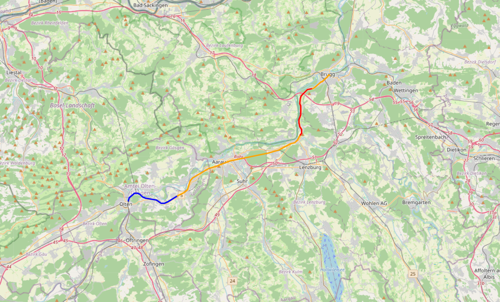

# Python Tutorial: GPS-Routen interaktiv visualisieren mit Folium

Wir bauen eine Applikation die GPS-Daten von einem Server abruft und die Route auf einer interaktiven Karte im Browser anzeigt. Temperatur- und Feuchtigkeitsüberschreitungen werden farbig eingefärbt. Das Resultat ist eine HTML-Datei die direkt im Browser geöffnet wird.

So sieht das Endergebnis aus:

> 

---

## Voraussetzungen

Du kennst bereits folgende Konzepte aus App 1:

- Funktionen (`def`, `return`)
- Listen und Dictionaries
- `for`-Schleifen und `enumerate`
- `if`, `elif`, `else`
- `float()` für Typumwandlung
- `pathlib` für Dateipfade
- Die Logik von `get_color` und `build_segments`

Neu in diesem Tutorial:

- HTTP-Requests mit `requests`
- JSON als Datenformat
- Interaktive Karten mit `folium`
- Fehlerbehandlung mit `try/except`

---

## Schritt 1: Packages installieren

Zwei neue Packages müssen installiert werden:

```bash
pip install requests folium
```

- **`requests`** — sendet HTTP-Anfragen an den Server
- **`folium`** — erstellt interaktive Karten als HTML-Datei

Die bekannten Packages `csv`, `io`, `pathlib` und `webbrowser` sind bereits in Python eingebaut.

---

## Schritt 2: Den Server verstehen

Statt einer lokalen CSV-Datei kommen die Daten jetzt von einem Server. Der Server stellt eine API zur Verfügung — das ist eine Sammlung von URLs die verschiedene Daten zurückgeben.

Die drei relevanten Endpunkte:

```
GET /containers                                    → alle Container
GET /containers/{container_id}/routes              → alle Routen eines Containers
GET /containers/{container_id}/routes/{route_id}   → CSV-Daten einer Route
```

`{container_id}` und `{route_id}` sind Platzhalter — dort kommt der echte Wert rein, z.B. `frodo` oder `horw-luzern`.

### Was ist JSON?

Die ersten zwei Endpunkte geben kein CSV zurück, sondern **JSON**. JSON ist ein Text-Format das überall verwendet wird um strukturierte Daten zu übertragen. Es sieht aus wie Python, ist aber ein String:

```json
{"containers": ["frodo", "gimli", "grp1", "grp2"]}
```

Python kann JSON direkt in ein Dictionary umwandeln:

```python
response = requests.get(url)
data = response.json()         # String → Python Dictionary
containers = data["containers"] # Zugriff auf den Schlüssel
```

Der dritte Endpunkt gibt CSV-Text zurück — genau wie in App 1, nur als String statt als Datei.

---

## Schritt 3: Daten vom Server abrufen

### Alle Container abrufen

```python
def fetch_containers(base_url):
    response = requests.get(base_url + "/containers")
    return response.json()
```

`response.json()` wandelt die Antwort automatisch in ein Python-Dictionary um. Der Schlüssel `"containers"` enthält die Liste der Containernamen.

### Alle Routen eines Containers abrufen

```python
def fetch_routes(base_url, container_id):
    response = requests.get(base_url + f"/containers/{container_id}/routes")
    return response.json()
```

Der f-String baut die URL dynamisch zusammen — `container_id` wird direkt in die URL eingesetzt.

### CSV-Daten einer Route abrufen

```python
def fetch_csv(base_url, container_id, route_id):
    response = requests.get(base_url + f"/containers/{container_id}/routes/{route_id}")
    rows = list(csv.reader(io.StringIO(response.text)))
    return rows
```

Hier kommt `io.StringIO` ins Spiel. `csv.reader` erwartet normalerweise eine Datei — aber wir haben nur einen String im Speicher. `io.StringIO` macht aus dem String eine **virtuelle Datei**, die `csv.reader` genau gleich lesen kann wie eine echte Datei:

```python
# App 1 — echte Datei von der Festplatte
with open(csv_path) as f:
    rows = list(csv.reader(f))

# App 2 — virtueller String vom Server
rows = list(csv.reader(io.StringIO(response.text)))
```

Das Ergebnis — `rows` — ist in beiden Fällen identisch.

---

## Schritt 4: Farben und Segmente

`get_color` und `build_segments` sind fast identisch zu App 1. Der einzige Unterschied: statt `simplekml.Color.red` verwenden wir einfache Farb-Strings die Folium versteht:

```python
def get_color(temp, humidity):
    if temp >= 25 and humidity >= 80:
        return "red"
    elif temp >= 25:
        return "orange"
    elif humidity >= 80:
        return "yellow"
    else:
        return "blue"
```

In `build_segments` ändert sich die Reihenfolge der Koordinaten. KML erwartete `(longitude, latitude)`, Folium erwartet `(latitude, longitude)`:

```python
# App 1 — KML
coord = (float(row[2]), float(row[1]))  # longitude zuerst

# App 2 — Folium
coord = (float(row[1]), float(row[2]))  # latitude zuerst
```

Der Rest von `build_segments` bleibt unverändert — das ist der Vorteil von sauber getrennten Funktionen.

---

## Schritt 5: Interaktive Karte mit Folium

Statt einer KML-Datei erstellen wir jetzt eine HTML-Datei mit einer interaktiven Karte.

```python
def save_html(segments, html_path):
    start = segments[0][1][0]  # erste Koordinate der Route als Startpunkt
    karte = folium.Map(location=start, zoom_start=11)

    for color, coords in segments:
        folium.PolyLine(
            locations=coords,
            color=color,
            weight=3
        ).add_to(karte)

    karte.save(str(html_path))
```

Schritt für Schritt:

**`segments[0][1][0]`** — greift auf die erste Koordinate der Route zu:
```python
segments[0]       # erstes Segment → ("blue", [(lat1,lon1), (lat2,lon2)])
segments[0][1]    # Koordinatenliste → [(lat1,lon1), (lat2,lon2)]
segments[0][1][0] # erste Koordinate → (lat1, lon1)
```

**`folium.Map()`** — erstellt die Karte mit einem Startpunkt und Zoomstufe.

**`folium.PolyLine()`** — zeichnet eine Linie auf die Karte. `locations` ist die Liste der Koordinaten, `color` die Farbe, `weight` die Liniendicke.

**`.add_to(karte)`** — fügt die Linie zur Karte hinzu.

**`karte.save()`** — speichert die fertige Karte als HTML-Datei.

---

## Schritt 6: Benutzerinteraktion

Der Benutzer soll Container und Route interaktiv im Terminal wählen. Damit Fehleingaben das Programm nicht zum Absturz bringen, verwenden wir `try/except` in einer Schleife:

```python
def select_container():
    containers = fetch_containers(base_url)["containers"]
    for i, container in enumerate(containers):
        print(f"{i+1}. {container}")
    while True:
        try:
            container_choice = int(input("Please enter Container Number "))
            container = containers[container_choice - 1]
            break
        except ValueError:
            print("Please enter a number")
        except IndexError:
            print(f"Please enter a number between 1 and {len(containers)}")
    return container
```

**`while True`** — läuft so lange bis der Benutzer eine gültige Eingabe macht.

**`try`** — versucht die Eingabe umzuwandeln und auf die Liste zuzugreifen.

**`except ValueError`** — wird ausgelöst wenn der Benutzer keine Zahl eingibt, z.B. `"abc"`.

**`except IndexError`** — wird ausgelöst wenn die Zahl ausserhalb der Liste liegt, z.B. `99` bei 4 Containern.

**`break`** — beendet die Schleife sobald alles erfolgreich war.

Wichtig: `containers[container_choice - 1]` muss **innerhalb** von `try` stehen — sonst wird der `IndexError` nicht abgefangen. `-1` weil der Benutzer ab 1 zählt, Python aber ab 0.

`select_route` funktioniert identisch, nur mit Routen statt Containern.

---

## Schritt 7: Alles zusammensetzen

Der vollständige, lauffähige Code:

```python
import requests
import io
import csv
import folium
from pathlib import Path
import webbrowser

base_url = "https://fl-17-240.zhdk.cloud.switch.ch"
script_dir = Path(__file__).parent
html_path = script_dir / "karte.html"

def fetch_containers(base_url):
    response = requests.get(base_url + "/containers")
    return response.json()

def fetch_routes(base_url, container_id):
    response = requests.get(base_url + f"/containers/{container_id}/routes")
    return response.json()

def fetch_csv(base_url, container_id, route_id):
    response = requests.get(base_url + f"/containers/{container_id}/routes/{route_id}")
    rows = list(csv.reader(io.StringIO(response.text)))
    return rows

def get_color(temp, humidity):
    if temp >= 25 and humidity >= 80:
        return "red"
    elif temp >= 25:
        return "orange"
    elif humidity >= 80:
        return "yellow"
    else:
        return "blue"

def build_segments(rows):
    segments = []
    current_color = None
    current_coords = []

    for row in rows:
        temp = float(row[3])
        humidity = float(row[4])
        color = get_color(temp, humidity)
        coord = (float(row[1]), float(row[2]))

        if color != current_color:
            if current_coords:
                segments.append((current_color, current_coords))
                current_coords = [current_coords[-1]]
            current_color = color

        current_coords.append(coord)

    if current_coords:
        segments.append((current_color, current_coords))

    return segments

def save_html(segments, html_path):
    start = segments[0][1][0]
    karte = folium.Map(location=start, zoom_start=11)
    for color, coords in segments:
        folium.PolyLine(
            locations=coords,
            color=color,
            weight=3
        ).add_to(karte)
    karte.save(str(html_path))

def select_container():
    containers = fetch_containers(base_url)["containers"]
    for i, container in enumerate(containers):
        print(f"{i+1}. {container}")
    while True:
        try:
            container_choice = int(input("Please enter Container Number "))
            container = containers[container_choice - 1]
            break
        except ValueError:
            print("Please enter a number")
        except IndexError:
            print(f"Please enter a number between 1 and {len(containers)}")
    return container

def select_route(container_id):
    routes = fetch_routes(base_url, container_id)["routes"]
    for i, route in enumerate(routes):
        print(f"{i+1}. {route}")
    while True:
        try:
            route_choice = int(input("Please enter Route Number "))
            route = routes[route_choice - 1]
            break
        except ValueError:
            print("Please enter a number")
        except IndexError:
            print(f"Please enter a number between 1 and {len(routes)}")
    return route

def main():
    container_id = select_container()
    route_id = select_route(container_id)
    rows = fetch_csv(base_url, container_id, route_id)
    segments = build_segments(rows)
    save_html(segments, html_path)
    webbrowser.open(str(html_path))

if __name__ == "__main__":
    main()
```

**Warum ist `main()` so schlank?**
Die Benutzerinteraktion ist in `select_container` und `select_route` ausgelagert. `main()` beschreibt nur den Ablauf auf hoher Ebene — jeder Schritt ist sofort lesbar ohne die Details zu kennen.

---

## Klassische Fehler

**`IndexError` nicht abgefangen:** Wenn `containers[choice - 1]` ausserhalb von `try` steht, wird der Fehler nicht abgefangen — auch wenn `except IndexError` vorhanden ist. Der Zugriff auf die Liste muss innerhalb von `try` stehen.

**Falsche Koordinatenreihenfolge:** Folium erwartet `(latitude, longitude)`, KML erwartet `(longitude, latitude)`. Ein falscher Wert und die Route erscheint irgendwo im Atlantik.

**`response.json()` statt `response.text`:** Bei den ersten zwei Endpunkten kommt JSON zurück — dort `response.json()` verwenden. Bei der CSV kommt Text zurück — dort `response.text` verwenden. Verwechslung führt zu einem Fehler.

**Dictionary-Schlüssel vergessen:** `response.json()` gibt ein Dictionary zurück, keine Liste. Ohne `["containers"]` bekommst du das ganze Dictionary statt der Liste.
